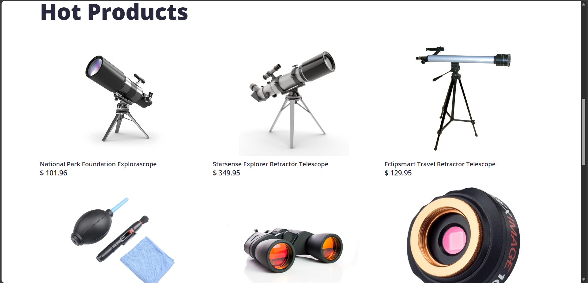
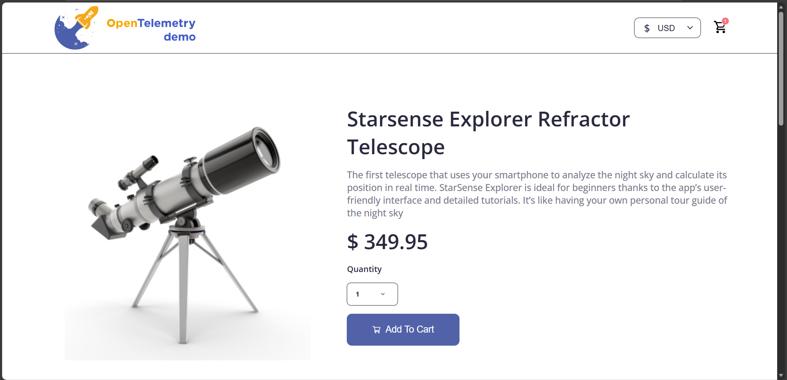
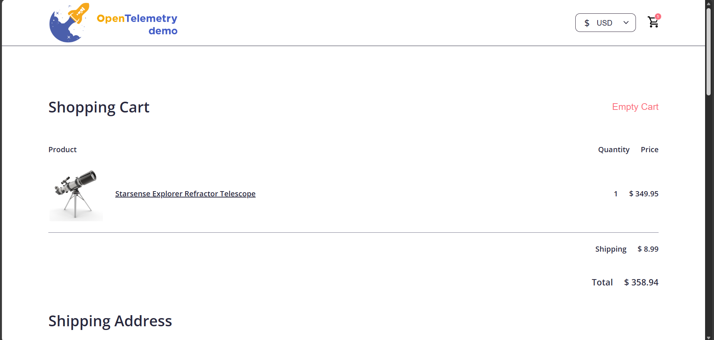

# Architecture Overview

This project is a fully automated DevOps implementation for a demo E-commerce application built using a multi-microservice architecture.  
The architecture includes containerized services, Kubernetes orchestration, Terraform-based cloud infrastructure, and GitOps-driven CI/CD pipelines.

## Key Highlights
- Microservices packaged into lightweight Docker containers.
- Workload deployed on an Amazon EKS cluster inside a custom VPC.
- Infrastructure provisioned using reusable Terraform modules.
- GitHub Actions manages CI workflows for build, test, and Docker image publishing.
- Argo CD provides automated, declarative GitOps-based deployments.
- AWS Route 53 DNS maps the frontend domain to the external load balancer securely.

This design reflects a realistic, production-grade cloud-native environment used in modern DevOps teams.

## Landing Page

## Product Catalog Page

## Product Explore Page

## Cart Page

