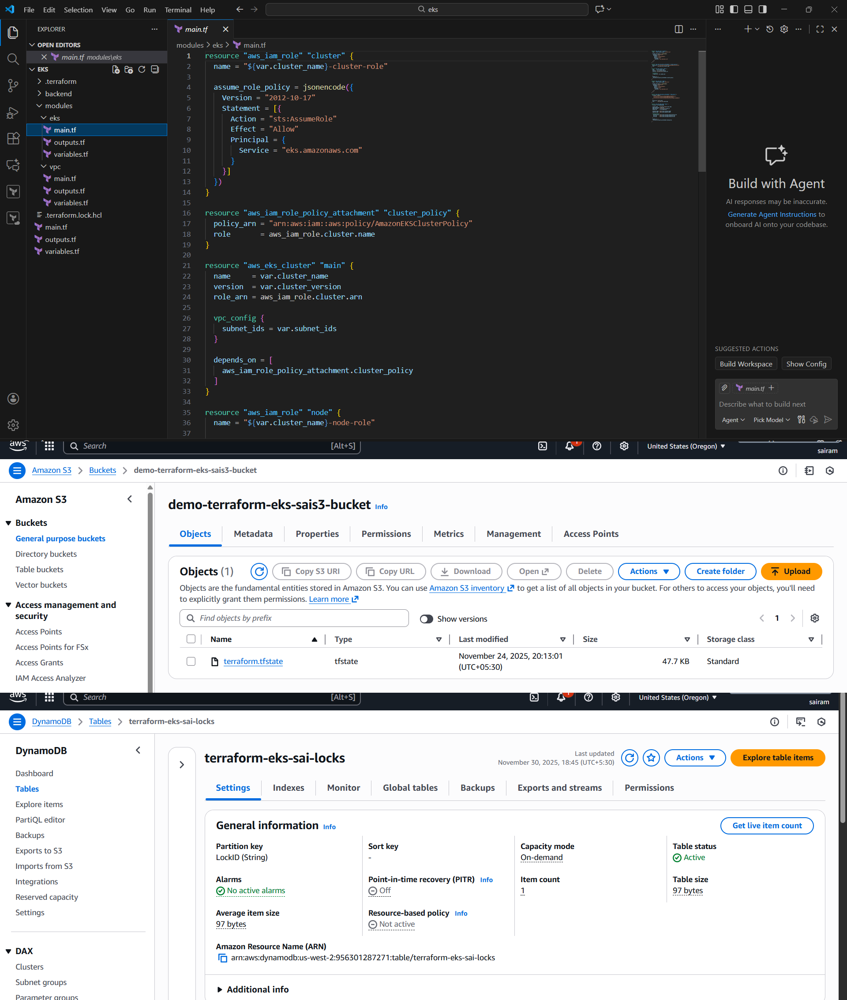
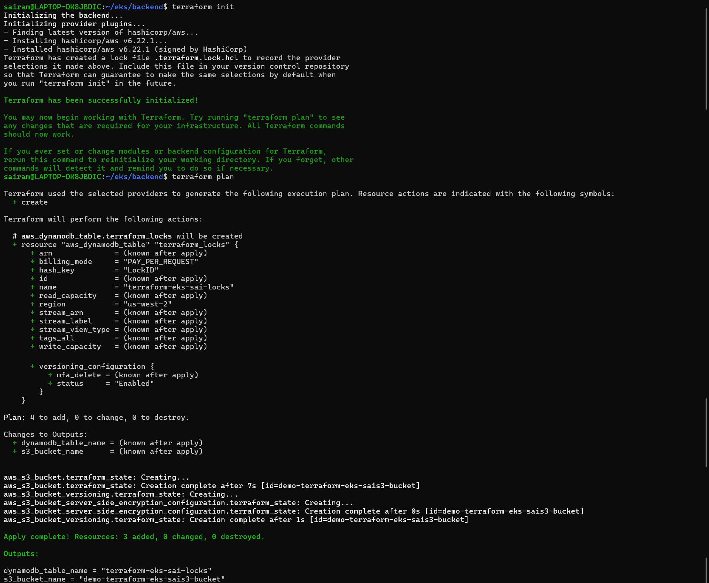
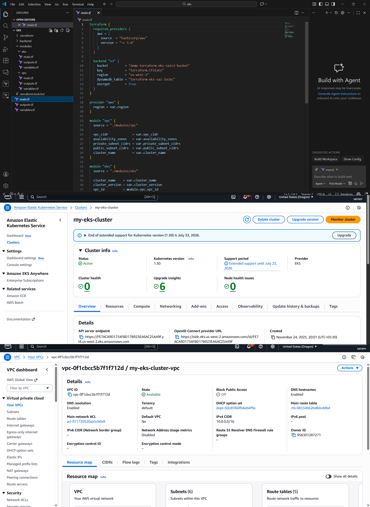
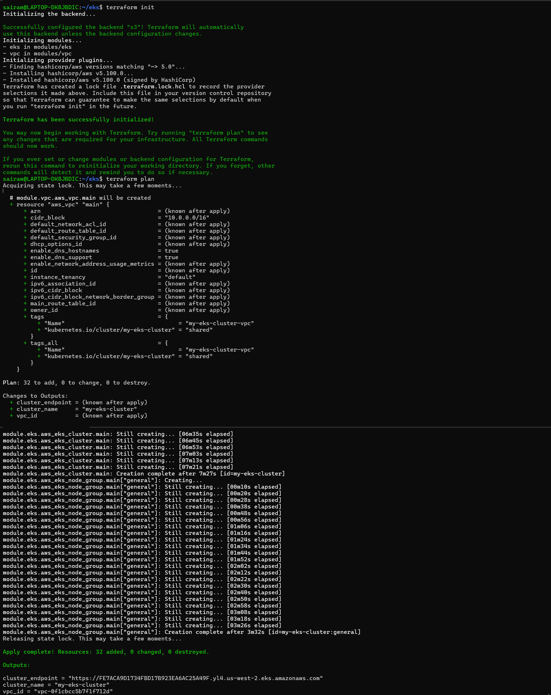

# Infrastructure Details (Terraform + AWS)

Infrastructure for this project is fully automated using Terraform.

## Components Provisioned
- **VPC** with public and private subnets.
- **EKS Cluster** deployed within private subnets for security.
- **Node groups** for running microservice workloads.
- **Load Balancer** (AWS ALB) for routing traffic to the frontend and backend services.

## Terraform Modules Implemented
- `vpc` module for networking setup.
- `eks` module for cluster and node group creation.

This modular IaC approach ensures reusability, maintainability, and consistent deployment of cloud infrastructure.

## Terraform S3 + DynamoDB Backend Output

## Terraform S3 + DynamoDB Created

## Terraform EKS + VPC Creation Output

## Terraform EKS + VPC Creation (Console View)

