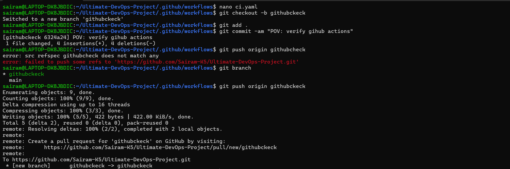
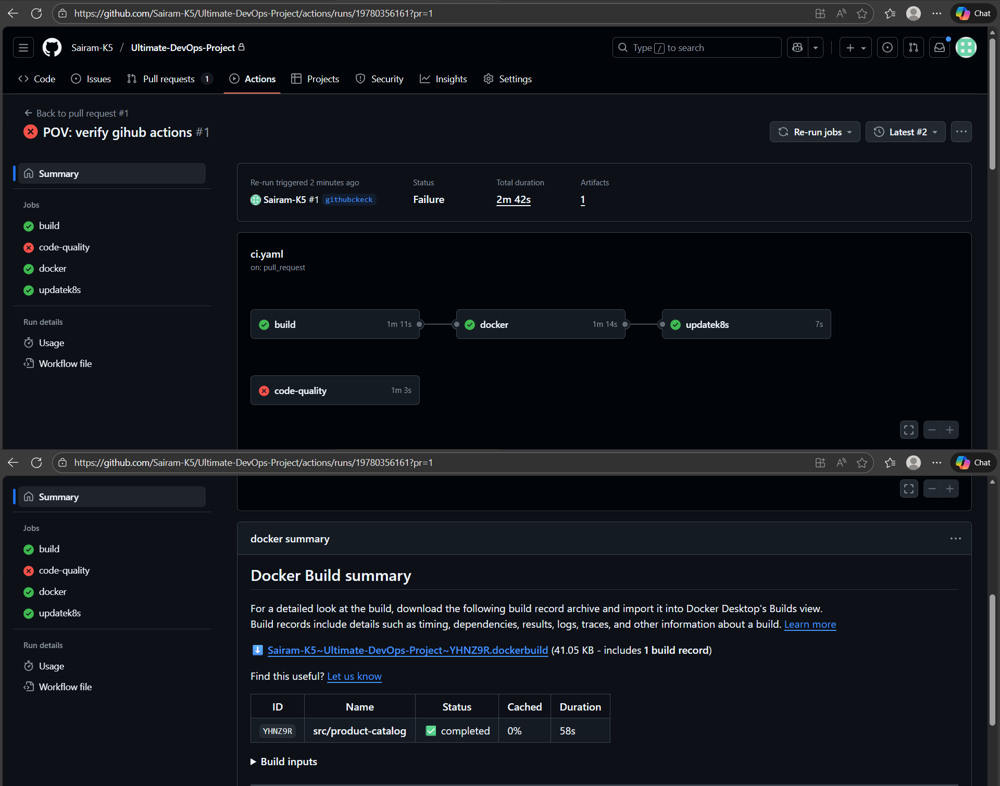
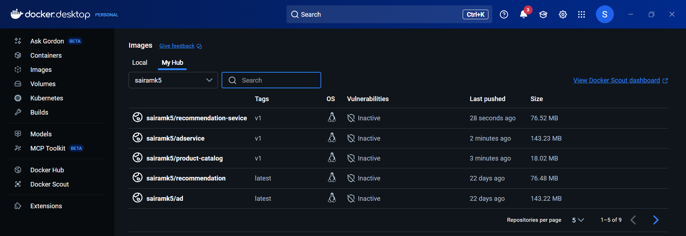

# CI/CD Pipeline (GitHub Actions)

The CI pipeline was implemented using GitHub Actions to automate build, test, and image deployment.

## CI Workflow Includes
- Code checkout on every push or pull request.
- Build and test Java microservice using Maven/Gradle.
- Build Docker image and push it to container registry.
- Update Kubernetes manifests automatically when new versions are built.
- Trigger Argo CD sync for automated deployment (GitOps).

This enables a complete "commit → deploy" lifecycle with no manual steps.

## GitHub Actions Pipeline Run

## GitHub Actions Build Logs

## GitHub Actions Pushed Image to DockerHub

