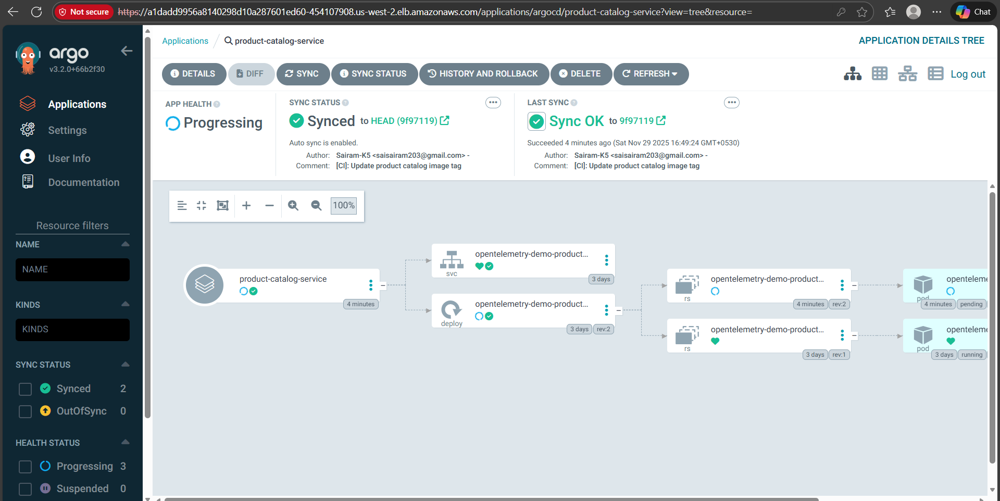

# GitOps Deployment with Argo CD

Argo CD is used for continuous deployment following GitOps principles.

## GitOps Workflow
1. GitHub Actions updates the deployment YAML with the new image tag.
2. Argo CD detects changes in the Git repository.
3. Argo CD automatically syncs and deploys the updated microservice to EKS.
4. Rollbacks can be performed easily through Argo CD UI or Git reverts.

This ensures fully automated, declarative, and version-controlled Kubernetes deployments.

## ArgoCD Application Details

