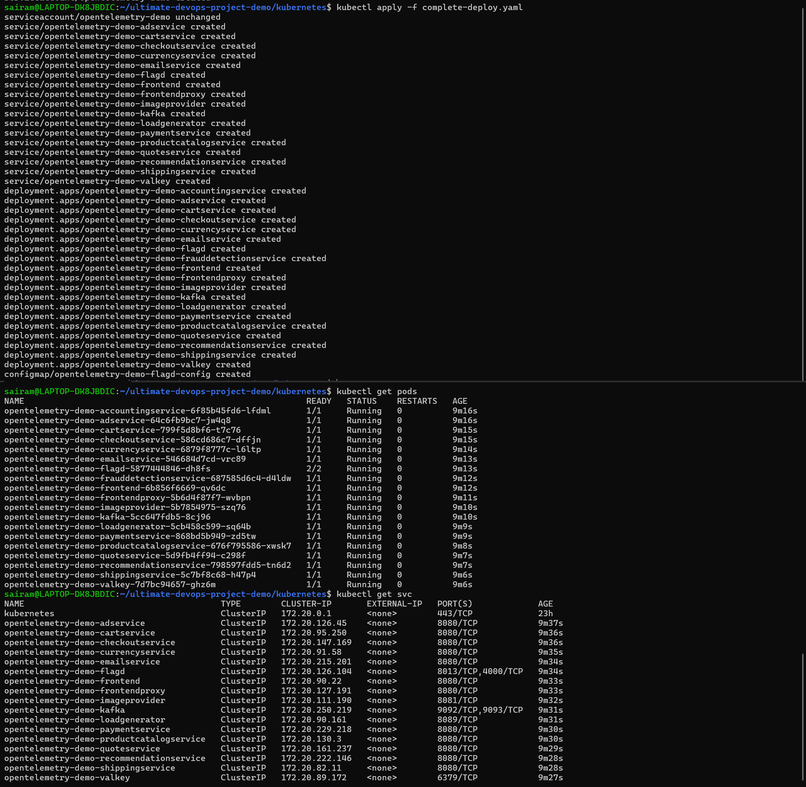
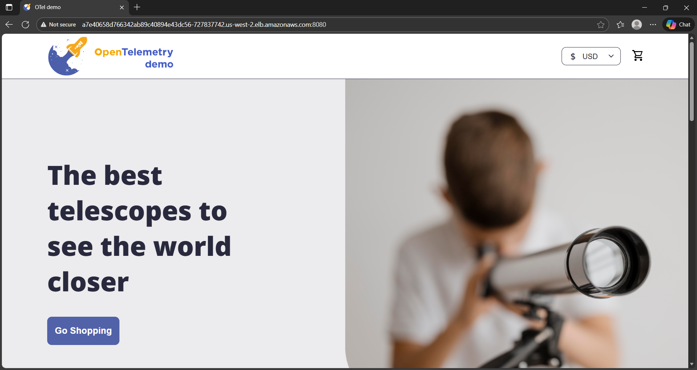

# Kubernetes & EKS Deployment

## Work Performed
- Deployed microservices on AWS EKS.
- Created Kubernetes Deployments, Services, and Ingress rules.
- Configured ALB Ingress Controller for external routing.
- Applied autoscaling (HPA) concepts to support scalable workloads.
- Ensured secure networking using private subnets for nodes.

EKS provides managed control plane components, reducing operational overhead.

## Kubernetes Deployments

## Application Access Through EKS

