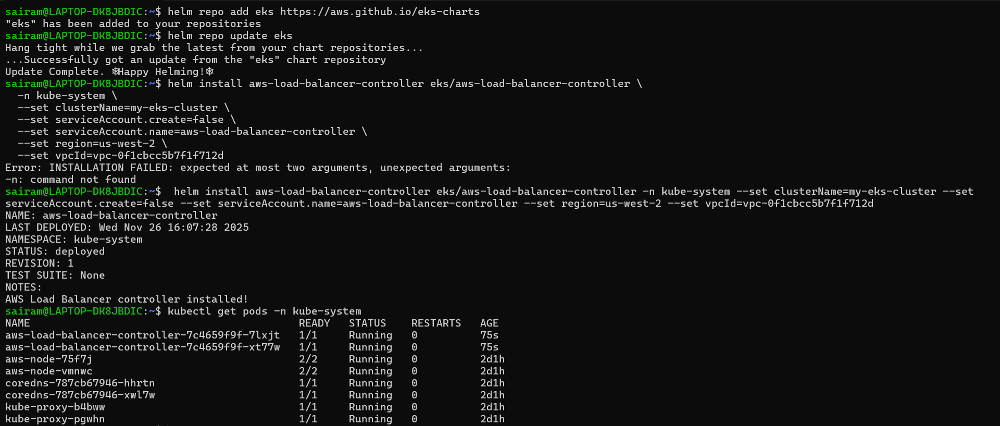
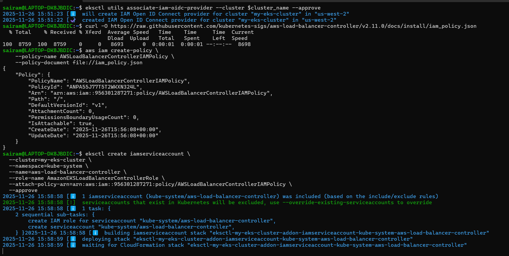

# Networking & DNS Configuration

## AWS Networking Used
- Custom **VPC** with public and private subnets.
- **Private subnets** host EKS worker nodes.
- **Load Balancer** (ALB) exposes the frontend and backend ingress endpoints.
- **Security groups** restrict traffic to required ports only.

## DNS Configuration
- An AWS Route 53 Hosted Zone was created.
- Domain nameservers were mapped from Route 53 to the domain provider.
- ALB DNS was mapped to the frontend domain for secure, external access.

This ensures a production-style DNS and ingress environment.

## ALB Ingress Creation (Screenshot 1)

## ALB Ingress Creation (Screenshot 2)

