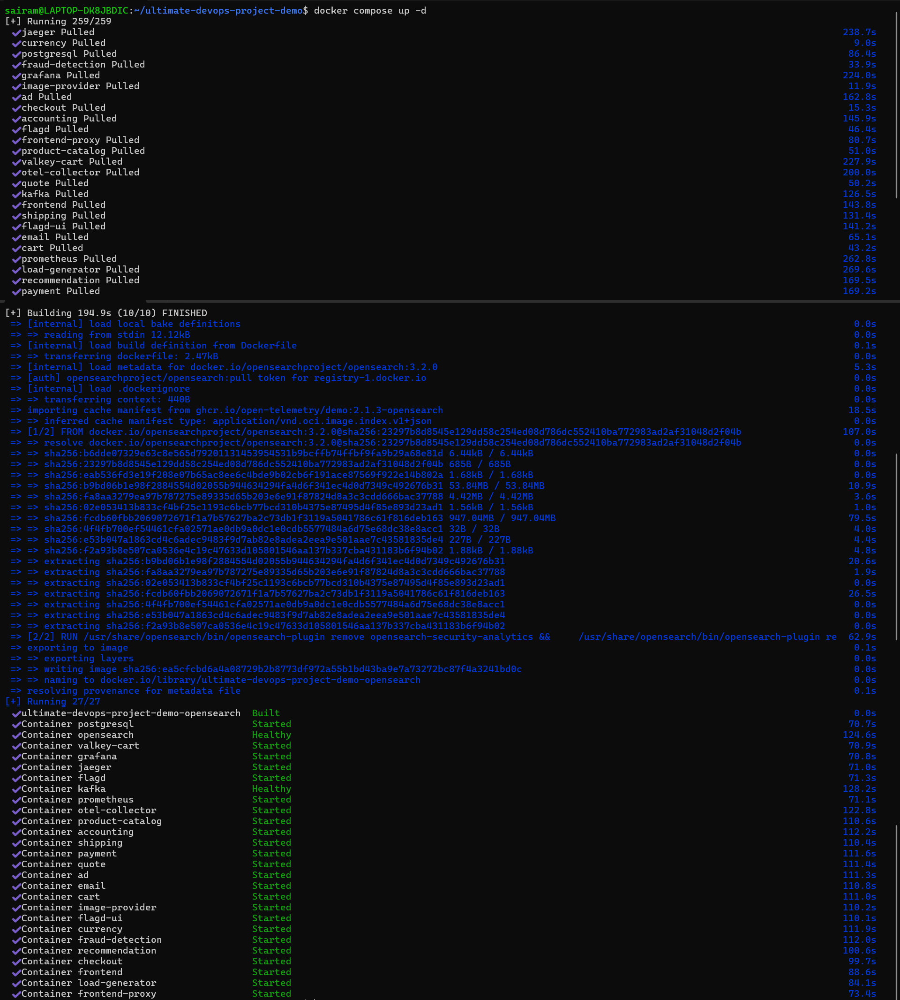
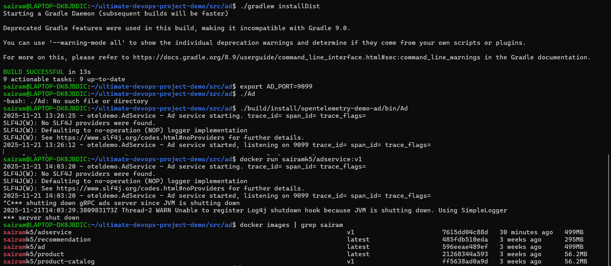
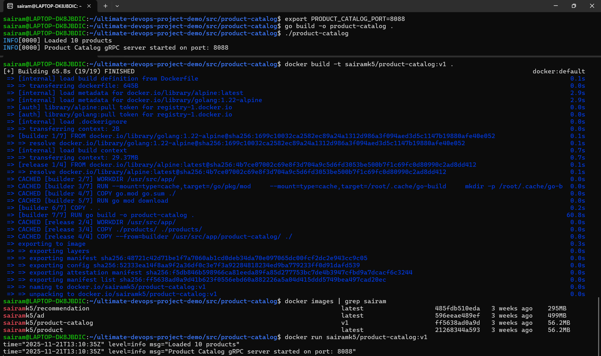
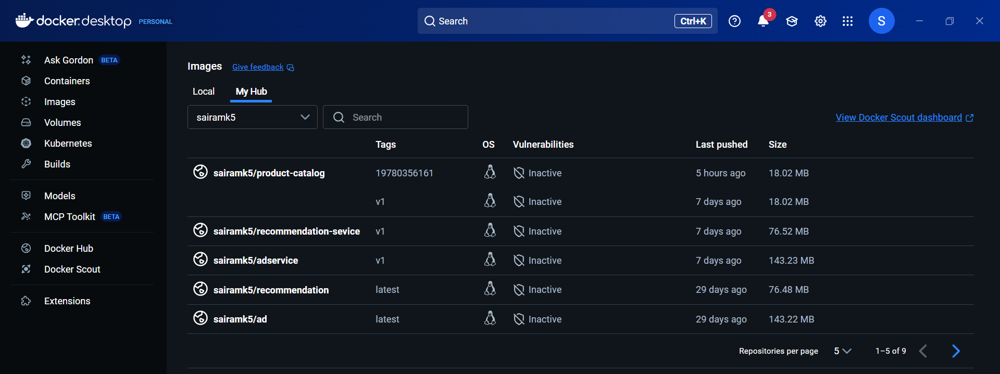

# Docker & Containerization Overview

This project uses **Docker** to containerize all microservices in the demo E-commerce platform. Containerization ensures consistent, portable, and isolated environments across development, CI/CD, and production deployments.

---

##  What I Implemented Using Docker

### Containerized All Microservices
Each microservice in the architecture includes a dedicated **Dockerfile**, built using industry best practices:

- Multi-stage builds for optimized image size
- Lightweight base images for faster startup
- Clear port exposure and environment configuration
- Production-ready container build process 

This ensures the application runs reliably in any environment.

---

# Docker Compose for Local Development & Testing

## Docker Compose is used to run the complete microservices stack locally.

## Start the full stack:
```bash
docker-compose up --build
```

## Start minimal stack:
```bash
docker-compose -f docker-compose.minimal.yml up --build
```
## Docker Compose Up


## Run integration tests:
```bash
docker-compose -f docker-compose-tests.yml up --abort-on-container-exit
```
This simplifies local development and testing workflows.


## Docker Build (adservice)


## Docker Build (productcatalog)



## Docker Image Registry Integration

As part of CI/CD automation:

- Docker images are built in GitHub Actions
- Images are tagged with version or commit SHA
- Images are pushed to a registry (DockerHub or ECR)
- Kubernetes manifests use the updated image tag
- Argo CD detects changes and deploys automatically

This creates a fully automated image build → push → deploy pipeline.

## Docker Push - Success


## Docker Push - Images


## How Docker Integrates With CI/CD

- Developer pushes code
- GitHub Actions builds Docker images
- Images pushed to registry
- Kubernetes manifests updated with new tag
- Argo CD auto-syncs deployments to EKS
- Updated containers run in production

This provides a single-touch deployment workflow.


## Importance of Docker in This Project

Docker enables:

- Consistent environments
- Fast, reproducible deployments
- Isolation between services
- Easy CI/CD automation
- Seamless scaling in Kubernetes
- Simplified debugging and testing

Docker is the foundation of this cloud-native architecture.
